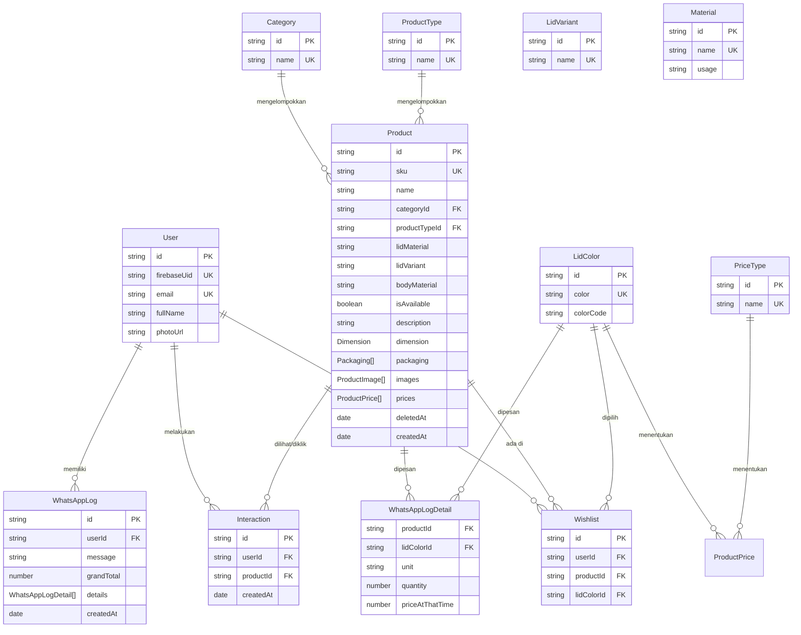

# Skema Database (MongoDB - Mongoose)

Dokumen ini memuat skema database lengkap untuk proyek **Toples Laksana**. Semua model diimplementasikan menggunakan Mongoose untuk ODM MongoDB.

---

## 📊 Diagram Hubungan Entitas (ERD)

---

## 🗂️ Detail Koleksi (Collections)

### 1. `users` (Model: `User`)
Menyimpan informasi profil pengguna yang masuk menggunakan akun Google (Firebase Authentication).

| Bidang (Field) | Tipe Data | Keterangan / Validasi |
| :--- | :--- | :--- |
| `id` | `String` | **Primary Key**, Required, Unique |
| `firebaseUid` | `String` | Unique, Sparse (Opsional, diisi jika login via Firebase) |
| `email` | `String` | Required, Unique, Lowercase, Trim, Indexed |
| `fullName` | `String` | Default: `""` |
| `photoUrl` | `String` | Default: `""` |

---

### 2. `products` (Model: `Product`)
Menyimpan detail informasi produk toples, dimensi fisik, gambar, serta relasi harga.

| Bidang (Field) | Tipe Data | Keterangan / Validasi |
| :--- | :--- | :--- |
| `id` | `String` | **Primary Key**, Required, Unique |
| `sku` | `String` | **Stock Keeping Unit**, Required, Unique |
| `name` | `String` | Nama Produk, Required |
| `categoryId` | `String` | Foreign Key ke `Category.id`, Required, Indexed |
| `productTypeId` | `String` | Foreign Key ke `ProductType.id`, Default: `null`, Indexed |
| `lidMaterial` | `String` | Material Tutup (Foreign Key ke `Material.id`), Required, Default: `""`, Indexed |
| `lidVariant` | `String` | Varian Tutup (Foreign Key ke `LidVariant.id`), Required, Default: `""`, Indexed |
| `bodyMaterial` | `String` | Material Botol/Toples (Foreign Key ke `Material.id`), Required, Default: `""`, Indexed |
| `isAvailable` | `Boolean` | Ketersediaan produk, Required, Default: `true`, Indexed |
| `description` | `String` | Deskripsi produk, Default: `""` |
| `dimension` | `Object` | Detail Dimensi Produk (Sub-dokumen `DimensionSchema`) |
| `packaging` | `Array` | Detail Kemasan/Karton (Array dari `PackagingSchema`) |
| `images` | `Array` | Daftar Gambar Produk (Array dari `ProductImageSchema`) |
| `prices` | `Array` | Daftar Relasi Harga Produk (Array dari `ProductPriceSchema`) |
| `deletedAt` | `Date` | Timestamp Soft Delete, Default: `null` |
| `createdAt` | `Date` | Timestamp waktu pembuatan (Mongoose `timestamps`) |

#### 📐 Sub-Schema `dimension`
* Diimplementasikan sebagai sub-dokumen tunggal (`_id: false`).

| Bidang (Field) | Tipe Data | Keterangan / Validasi |
| :--- | :--- | :--- |
| `heightCm` | `Number` | Tinggi dalam centimeter, Required, Default: `0` |
| `diameterCm` | `Number` | Diameter dalam centimeter, Required, Default: `0` |
| `volumeMl` | `Number` | Volume dalam mililiter, Required, Default: `0` |
| `weightGram` | `Number` | Berat produk dalam gram, Required, Default: `0` |

#### 📦 Sub-Schema `packaging`
* Diimplementasikan sebagai array sub-dokumen (`_id: false`).

| Bidang (Field) | Tipe Data | Keterangan / Validasi |
| :--- | :--- | :--- |
| `lengthCm` | `Number` | Panjang karton dalam cm, Default: `null` |
| `widthCm` | `Number` | Lebar karton dalam cm, Default: `null` |
| `heightCm` | `Number` | Tinggi karton dalam cm, Default: `null` |
| `weightKg` | `Number` | Berat total karton dalam kg, Default: `null` |

#### 🖼️ Sub-Schema `images`
* Diimplementasikan sebagai array sub-dokumen (`_id: false`).

| Bidang (Field) | Tipe Data | Keterangan / Validasi |
| :--- | :--- | :--- |
| `imageUrl` | `String` | URL berkas gambar, Required |
| `isPrimary` | `Boolean` | Apakah gambar utama produk, Default: `false` |

#### 🏷️ Sub-Schema `prices`
* Diimplementasikan sebagai array sub-dokumen (`_id: false`).

| Bidang (Field) | Tipe Data | Keterangan / Validasi |
| :--- | :--- | :--- |
| `lidColorId` | `String` | Foreign Key ke `LidColor.id`, Required |
| `priceTypeId` | `String` | Foreign Key ke `PriceType.id`, Required |
| `price` | `Number` | Nominal harga produk, Required |
| `quantity` | `Number` | Minimum kuantitas untuk jenis harga tersebut, Default: `1` |

---

### 3. `categories` (Model: `Category`)
Kategori produk (misal: *Toples Jar*, *Botol*, dll).

| Bidang (Field) | Tipe Data | Keterangan / Validasi |
| :--- | :--- | :--- |
| `id` | `String` | **Primary Key**, Required, Unique |
| `name` | `String` | Nama Kategori, Required, Unique |

---

### 4. `producttypes` (Model: `ProductType`)
Tipe atau sub-kategori produk (misal: *Toples PET*, *Toples PP*, dll).

| Bidang (Field) | Tipe Data | Keterangan / Validasi |
| :--- | :--- | :--- |
| `id` | `String` | **Primary Key**, Required, Unique |
| `name` | `String` | Nama Tipe Produk, Required, Unique |

---

### 5. `lidcolors` (Model: `LidColor`)
Pilihan warna untuk tutup produk.

| Bidang (Field) | Tipe Data | Keterangan / Validasi |
| :--- | :--- | :--- |
| `id` | `String` | **Primary Key**, Required, Unique |
| `color` | `String` | Nama Warna Tutup (misal: *Merah*, *Kuning*), Required, Unique |
| `colorCode` | `String` | Kode warna HEX (misal: `#FF0000`), Default: `""` |

---

### 6. `lidvariants` (Model: `LidVariant`)
Jenis/varian model tutup (misal: *Tutup Ulir*, *Tutup Press*, dll).

| Bidang (Field) | Tipe Data | Keterangan / Validasi |
| :--- | :--- | :--- |
| `id` | `String` | **Primary Key**, Required, Unique |
| `name` | `String` | Nama Varian Tutup, Required, Unique |

---

### 7. `materials` (Model: `Material`)
Jenis material plastik atau bahan produk (misal: *PET*, *PP*, *Aluminium*).

| Bidang (Field) | Tipe Data | Keterangan / Validasi |
| :--- | :--- | :--- |
| `id` | `String` | **Primary Key**, Required, Unique |
| `name` | `String` | Nama Material, Required, Unique |
| `usage` | `String` | Batasan penggunaan material. Enum: `["body", "lid", "both"]`, Required, Default: `"both"` |

---

### 8. `pricetypes` (Model: `PriceType`)
Tipe/tingkatan harga yang ditawarkan (misal: *Eceran*, *Grosir*, *Dus-dusan*).

| Bidang (Field) | Tipe Data | Keterangan / Validasi |
| :--- | :--- | :--- |
| `id` | `String` | **Primary Key**, Required, Unique |
| `name` | `String` | Nama Tipe Harga, Required, Unique |

---

### 9. `wishlists` (Model: `Wishlist`)
Menyimpan daftar produk favorit atau produk yang diminati oleh pengguna.

| Bidang (Field) | Tipe Data | Keterangan / Validasi |
| :--- | :--- | :--- |
| `id` | `String` | **Primary Key**, Required, Unique |
| `userId` | `String` | Foreign Key ke `User.id`, Required |
| `productId` | `String` | Foreign Key ke `Product.id`, Required |
| `lidColorId` | `String` | Foreign Key ke `LidColor.id`, Default: `null` |

* **Unique Index**: Kombinasi `{ userId: 1, productId: 1, lidColorId: 1 }` diset unik untuk menghindari duplikasi item wishlist yang sama.

---

### 10. `interactions` (Model: `Interaction`)
Mencatat statistik aktivitas klik/kunjungan produk oleh pengguna untuk keperluan analitik admin.

| Bidang (Field) | Tipe Data | Keterangan / Validasi |
| :--- | :--- | :--- |
| `id` | `String` | **Primary Key**, Required, Unique |
| `userId` | `String` | Foreign Key ke `User.id`, Required |
| `productId` | `String` | Foreign Key ke `Product.id`, Required |
| `createdAt` | `Date` | Timestamp kunjungan (Mongoose `timestamps`) |

* **Indexes**:
  * `{ productId: 1, createdAt: -1 }` (Untuk mempermudah statistik per produk berdasarkan waktu)
  * `{ userId: 1, createdAt: -1 }` (Untuk melihat riwayat aktivitas per pengguna)

---

### 11. `whatsapplogs` (Model: `WhatsAppLog`)
Mencatat log riwayat ekspor keranjang belanja/pesanan yang dikirimkan oleh pengguna ke WhatsApp sales.

| Bidang (Field) | Tipe Data | Keterangan / Validasi |
| :--- | :--- | :--- |
| `id` | `String` | **Primary Key**, Required, Unique |
| `userId` | `String` | Foreign Key ke `User.id`, Required |
| `message` | `String` | Teks pesan mentah yang dikirimkan ke WhatsApp, Required |
| `grandTotal` | `Number` | Total nilai transaksi pada saat dikirimkan, Required, Default: `0` |
| `details` | `Array` | Detail produk pesanan (Array dari `WhatsAppLogDetailSchema`) |
| `createdAt` | `Date` | Tanggal pengiriman pesan (Mongoose `timestamps`) |

#### 📝 Sub-Schema `details` (WhatsAppLogDetail)
* Diimplementasikan sebagai array sub-dokumen (`_id: false`).

| Bidang (Field) | Tipe Data | Keterangan / Validasi |
| :--- | :--- | :--- |
| `productId` | `String` | Foreign Key ke `Product.id`, Required |
| `lidColorId` | `String` | Foreign Key ke `LidColor.id`, Default: `null` |
| `unit` | `String` | Satuan produk (misal: *pcs*, *dus*), Default: `"pcs"` |
| `quantity` | `Number` | Jumlah produk yang dipesan, Required, Default: `1` |
| `priceAtThatTime` | `Number` | Harga per pcs produk pada waktu checkout dibuat, Required |

* **Indexes**:
  * `{ userId: 1, createdAt: -1 }` (Untuk melacak riwayat transaksi WhatsApp per pengguna)
